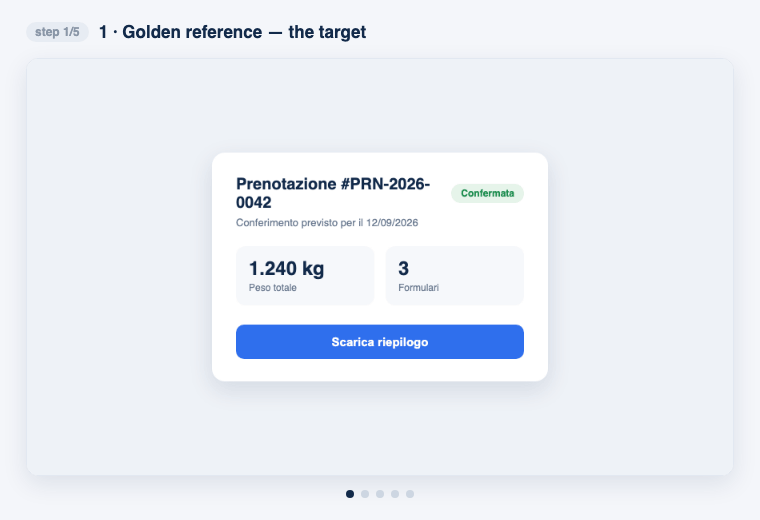
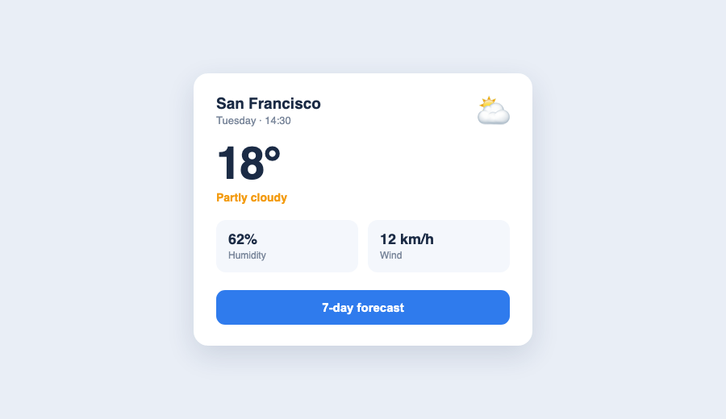
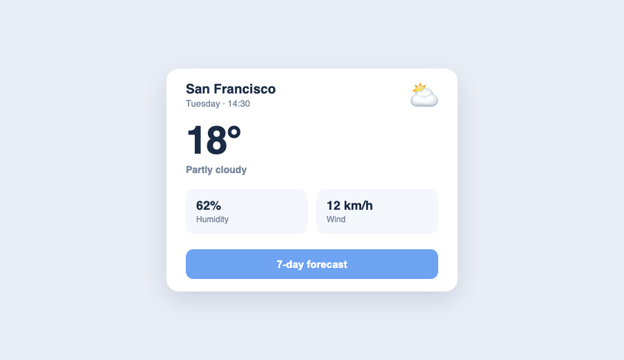
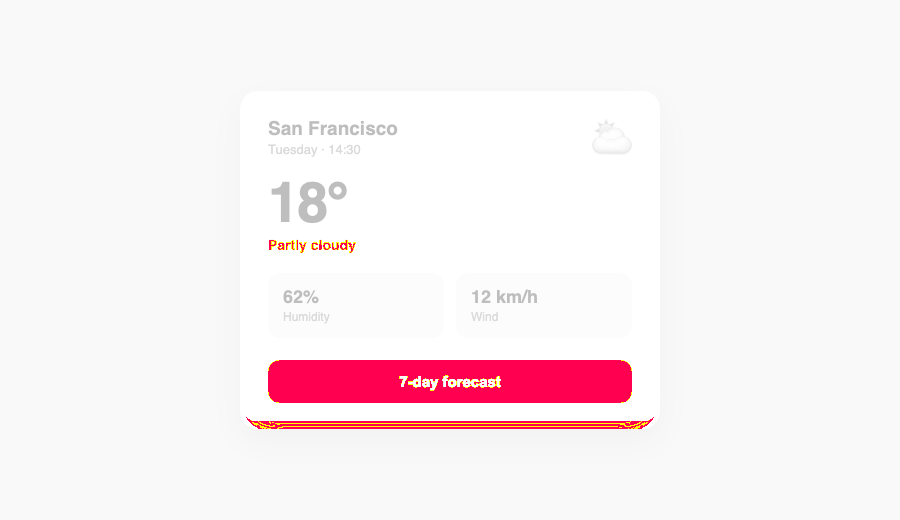

# match-reference

[](LICENSE)


A coding-agent skill — for [Claude Code](https://claude.com/claude-code), [Codex](https://openai.com/codex/), Cursor, or any tool that reads `AGENTS.md` — plus a set of standalone Node scripts, that helps you rebuild a frontend so it looks **(near) pixel-identical** to a visual reference: a design mockup, a screenshot of another site or app, a photo of a UI, or an existing page you want to clone.

Instead of eyeballing *"looks close enough"*, it **measures** the gap with a pixel diff and tells you exactly where the layout is off: a clipped column, wrong padding, a text wrap, an off color.



## Why

"It resembles it" is not a spec. A pixel diff turns a vague feeling into a number and a picture: the differing zones light up in bright pink, so you fix the real problem instead of guessing. You close the gap region by region until it matches.

## Example

The reference (target) vs. an in-progress build with three mistakes — a lighter button blue, a greyed-out condition label, and tighter card padding:

| Reference | Your build | Diff (`3.72%`) |
|---|---|---|
|  |  |  |

The diff makes the mistakes obvious at a glance: the whole button lights up (wrong color), so does the condition label, and the padding shift shows as a pink line at the card's bottom edge. Fix those, re-shoot, and the pink disappears.

## How it works — a 3-part loop

1. **Golden reference (immutable).** Save the target image as a fixed PNG. Never touch it; it's the ruler.
2. **Deterministic screenshot.** Screenshot your frontend with a pinned, repeatable browser environment (fixed viewport, scale, locale, timezone, light color scheme, animations off, fonts loaded). Without this the screenshot wobbles and the diff is just noise.
3. **Diff & calibrate.** Pixel-diff the two images, then crop by region (header, table, summary, footer) and calibrate one zone at a time until each matches.

```
reference.png ──┐
                ├──▶ compare.mjs ──▶ diff.png  (pink = different) + "% differing"
your page ──▶ capture.mjs ──┘            │
     ▲                                   ▼
     └──────── fix CSS/HTML, re-shoot ◀──┘   (repeat per region)
```

## Install

Every path needs [Node.js](https://nodejs.org) ≥ 18. The one-time dependency
install is always the same:

```bash
npm install
npx playwright install chromium   # downloads a ~180 MB headless Chromium
```

### Claude Code

Clone into your personal skills folder and install the deps:

```bash
git clone https://github.com/Filtar2000/match-reference ~/.claude/skills/match-reference
cd ~/.claude/skills/match-reference
npm install && npx playwright install chromium
```

Then invoke it with `/match-reference`, or just describe wanting to match a
reference image — the `SKILL.md` description lets Claude pick it up. Claude reads
the workflow from `SKILL.md`.

### Codex (and Cursor, or any agent that reads `AGENTS.md`)

These tools don't have a "skills" folder — they read an `AGENTS.md` from the
working directory. Two ways:

**A. Clone it into the project you're working on** (simplest):

```bash
cd your-project
git clone https://github.com/Filtar2000/match-reference tools/match-reference
cd tools/match-reference && npm install && npx playwright install chromium
```

The agent picks up `tools/match-reference/AGENTS.md`. If you keep a root
`AGENTS.md`, add one line pointing to it, e.g.
`> To match a UI against a reference image, follow tools/match-reference/AGENTS.md`.

**B. Install once, globally.** Clone anywhere, install the deps, and copy the
workflow into your global Codex instructions:

```bash
git clone https://github.com/Filtar2000/match-reference ~/tools/match-reference
cd ~/tools/match-reference && npm install && npx playwright install chromium
cat AGENTS.md >> ~/.codex/AGENTS.md   # adjust script paths to ~/tools/match-reference/scripts
```

Then just ask Codex to "match this frontend to the attached reference" and point
it at the scripts.

### Standalone (no agent at all)

The three scripts in `scripts/` are plain Node and run on their own — see
**Usage** below.

```bash
git clone https://github.com/Filtar2000/match-reference
cd match-reference && npm install && npx playwright install chromium
```

## Usage

```bash
# 1. Screenshot your page deterministically (match the reference's dimensions)
node scripts/capture.mjs http://localhost:5000/ shots/mine.png --width 1536 --height 1024

# 2. Diff against the golden reference
node scripts/compare.mjs reference/target.png shots/mine.png diff/full.png
#    -> "Differing pixels: 12345 / 1572864  (0.785%)"  + diff/full.png with pink zones

# 3. Crop a region and calibrate it in isolation
node scripts/crop.mjs reference/target.png reference/header.png 0 0 1536 120
node scripts/crop.mjs shots/mine.png       shots/header.png     0 0 1536 120
node scripts/compare.mjs reference/header.png shots/header.png diff/header.png
```

Suggested working layout:

```
pixel/
  reference/   # the golden reference(s), immutable
  shots/       # screenshots of your frontend
  diff/        # difference PNGs
```

### Scripts

| Script | What it does | Key flags |
|---|---|---|
| `capture.mjs <url> <out.png>` | Deterministic Playwright screenshot | `--width` `--height` `--full` `--selector "css"` `--scale` `--wait` `--device "iPhone 13"` `--match <ref.png>` |
| `compare.mjs <ref.png> <cand.png> <diff.png>` | Pixel diff (pixelmatch), prints % + writes pink diff | `--threshold` (default 0.12, lower = stricter) `--aa` |
| `crop.mjs <in.png> <out.png> <x> <y> <w> <h>` | Crop a region (pngjs; works without ImageMagick) | — |
| `resize.mjs <in.png> <out.png> <w> [h]` | Resize a PNG (bilinear, pngjs) to normalize sizes before diffing | height auto if omitted |

**Tip for `capture.mjs`:** add a CSS rule for `html.visual-test` in your frontend to zero animations/transitions/caret during the shot — `capture.mjs` adds that class before shooting. The pinned `locale`/`timezoneId` default to Italy; edit them in `capture.mjs` to match your target's region.

## Different sizes, mobile, imprecise references

Your reference will rarely be the exact pixel size of your build — it might be a phone screenshot, a mockup exported at an odd size, or a lossy image. `compare.mjs` needs both images at the **same pixel size**; here's how to get there.

- **Shoot at the reference's exact size** — the one-flag fix:
  ```bash
  node scripts/capture.mjs http://localhost:5000/ shots/mine.png --match reference/target.png
  ```
- **Can't re-shoot to match?** Normalize with `resize.mjs` (scale one image to the other's size). A retina @2x reference down to @1x:
  ```bash
  node scripts/resize.mjs reference/raw@2x.png reference/target.png 900
  ```
- **Mobile / phone reference** — use a device preset:
  ```bash
  node scripts/capture.mjs http://localhost:5000/ shots/mine.png --device "iPhone 13"
  ```
  Any Playwright device works ("Pixel 7", "iPad Mini", ...). A phone's 2–3× pixel density makes the PNG larger — combine with `--match` or `resize.mjs` for a specific size.
- **Imprecise reference** (a photo of a screen, a hand-cropped or compressed image): a 0% diff is impossible and isn't the goal. Treat the diff as a **heat map of where you're structurally off** — raise `--threshold` (≈ `0.2`–`0.3`), calibrate region by region, and trust layout, spacing, and color over exact pixels.

A resize blurs slightly, so after one don't chase 0% — lean on region structure. Once both images are the same size, the loop is exactly the same.

## Golden rule: content beats pixels

Where the reference has mistakes or choices you should **not** copy (wrong labels, an extra element, fake placeholder data), keep your version. The goal is the *look*, not cloning the mockup's mistakes. The diff will flag those zones — that's expected; ignore it there.

## Notes

- Images must match in size or `compare.mjs` refuses (re-shoot with the reference's `--width/--height`, or handle retina with `--scale 2`).
- If the reference uses fonts your frontend lacks, the diff is noisy wherever there's text — load the same (or closest) fonts before chasing pixels.

## License

MIT — see [LICENSE](LICENSE).
